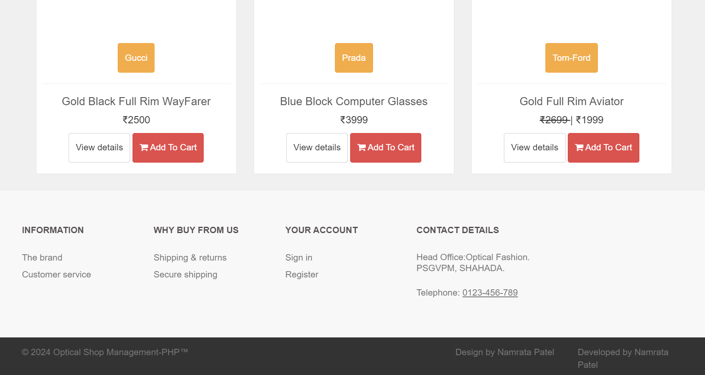
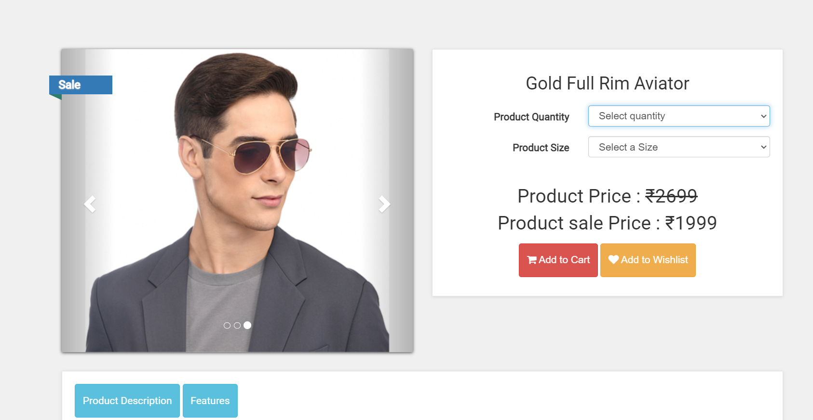
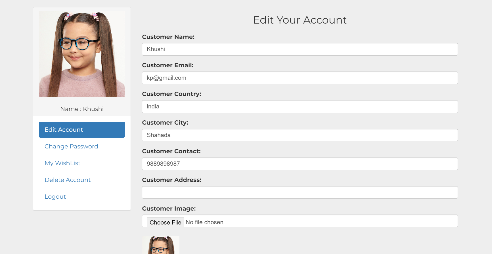
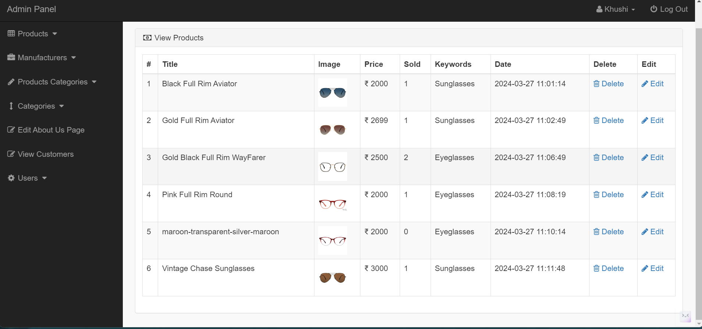

<p align="center">
  <h1 align="center">Optical Shop Management </h1>

  <p align="center">
     This project is an Optical Shop Management System built using HTML, CSS, PHP, MySQL, and other technologies. It includes an admin panel for managing sunglasses, eyeglasses, and computer glasses inventory.
    <br/>
    <br/>
    <a href="https://github.com/Namratapatel9027/Optical-Shop-Management"><strong>Explore the Project »</strong></a>
    <br/>
    <br/>
  </p>
</p>

## Table Of Contents

* [About the Project](#about-the-project)
* [Built With](#built-with)
* [Getting Started](#getting-started)
  * [Installation](#installation)
* [Contributing](#contributing)
* [License](#license)

## About The Project

<h1 align="center">Screenshots</h1>

<!-- Add screenshots of your web application -->






Here's why:

* Developed optical shop management system with MySQL database for inventory.
* Integrated CRUD operations for easy glasses collection management.
* Included admin panel for comprehensive shop oversights, and smartphones.
* Streamlined inventory handling and operations efficiency.
* ATS-friendly system for efficient management of optical store.

## Built With

Frontend: HTML, CSS, JavaScript, PHP, MySQL

## Getting Started

This is an example of how you can set up the project locally.

### Installation

1. Clone the Repository: Clone this repository to your local machine using the following command:

```sh
git clone https://github.com/Namratapatel9027/Optical-Shop-Management.git
```

2. Navigate to the Directory: Move into the project directory:

```sh
cd Optical-Shop-Management
```

3. Open the Xampp: On the MySQL and Apache Server.

4. Start the Server: Go to Chrome and write localhost/optical-shop-management.

## Contributing

Contributions are welcome! If you find any bugs or have suggestions for new features, please open an issue or submit a pull request. For major changes, please open an issue first to discuss the proposed changes.

## License

This project is licensed under the MIT License - see the LICENSE file for details.

Thank you for choosing the Optical Shop Management🚀.
